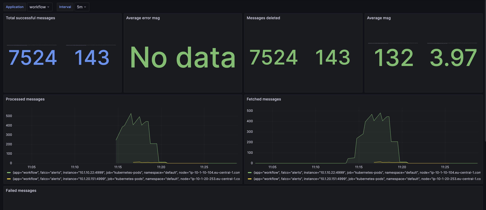

# SQS.Extensions

[](https://www.nuget.org/packages/SQS.Extensions/)
[](https://github.com/imperugo/SQS.Extensions/blob/main/LICENSE)

SQS.Extensions is a .NET library with the idea to helps developer using AWS Sqs.

Behind the scenes it covers a set of repetitive tasks, handle complexity and highly customizable.

## Quickstart

### Installation

Add the NuGet Package to your project:

```bash
dotnet add package SQS.Extensions
```

### Configuration

Configuration is pretty simple if you don't want any particular customization. 

```c#
// This is needed by AWS library
builder.Services.AddDefaultAWSOptions(new AWSOptions { Region = RegionEndpoint.EUCentral1 });
builder.Services.AddAWSService<IAmazonSQS>();

// Dependency Injection
// Configuration
builder.Services.AddSqsConsumerServices(
    () => new AwsConfiguration(region: "eu-central-1", accountId: "775704350706")
{
    QueuePrefix = "develop-"
});

// Consumer registrations
// this is needed only in you have to dequeue from SQS
// in case of send only is not needed
builder.Services.AddSqsConsumer<MySqsConsumer>();
```

### Sending message to queue

```c#
app.MapPost("/SendMessageToQueue", async (
    MySqsMessage request,
    ISqsDispatcher sqsDispatcher,
    CancellationToken cancellationToken) =>
{
    // Do your stuff
    await sqsDispatcher.QueueAsync(request, Constants.QUEUE_NAME_1, cancellationToken);

    return Results.NoContent();
});
```

### Pooling message from queue

The library allows you to receive messages using a background task. Everytime a new message came into the queue, you function will be invocated.

> You could register multiple consumers with different queues

```c#
internal sealed class MySqsConsumer : SqsHostedService<MySqsMessage>
{
    public MySqsConsumer(
        ILogger<MySqsConsumer> logger,
        ISqsMessagePumpFactory messagePumpFactory)
            : base(logger, messagePumpFactory)
    {
    }

    protected override Func<MySqsMessage?, CancellationToken, Task> ProcessMessageFunc => ConsumeMessageAsync;

    protected override MessagePumpConfiguration MessagePumpConfiguration =>
        new (Constants.QUEUE_NAME_1)
        {
            // waiting time between calls to SQS.
            BatchDelay = TimeSpan.FromSeconds(10),

            // the max number of concurrent operations
            MaxConcurrentOperation = 10,

            // if true every time the app start cleans the queue
            // helpful for testing
            PurgeOnStartup = true
        };

    private Task ConsumeMessageAsync(MySqsMessage? message, CancellationToken cancellationToken)
    {
        // Do your staff here

        return Task.CompletedTask;
    }
}
```

### Customization

#### Serialization

The library allows you to choice your favorite serialization library. If you don't specify anything, the recente System.Text.Json will be used.
If you prefer to use something different you can create your own serializer in this way

```c#
public sealed class MySuperSerializer : IMessageSerializer
{
    public string Serialize<T>(T itemToSerialized)
    {
    }

    public T? Deserialize<T>(string serializedObject)
    {
        
    }
}
```

Then register it on DI

```csharp
builder.Services.AddSqsConsumerWithCustomSerializer<MySuperSerializer>(() => new AwsConfiguration(region: "eu-central-1", accountId: "775704350706")
{
    QueuePrefix = "develop-"
});
```

#### Queue name customization

Out of the box the library offers you the opportunity to add automatically a prefix and/or suffix to the queue name.
Sometimes this could be helpful for temporary queue or for different environment like development and production (would be better to use different account for security reason)

When you add the library to your DI you can specify these parameters

```csharp
// Dependency Injection
builder.Services.AddSqsConsumerServices(
    () => new AwsConfiguration()
{
    QueuePrefix = "develop-",
    QueueSuffix = "-temp"
});
```

If you don't like this way or you have a super strange queue name algorithm you can add your custom logic in this way:

```csharp
/// <inheritdoc />
public sealed class MySuperSqsQueueHelper : DefaultSqsQueueHelper
{
    /// <inheritdoc />
    public MySuperSqsQueueHelper(AwsConfiguration awsConfiguration, IAmazonSQS sqsClient)
        : base(awsConfiguration, sqsClient)
    {
    }

    public override ValueTask<string> GetQueueUrlAsync(string queueName)
    {
        // Add your logic here.
    }
}
```

Then register it on DI

```csharp
builder.Services.AddSqsConsumerWithCustomQueueHeper<MySqsQueueHelper>(
    () => new AwsConfiguration();
```

## Telemetry

The library is ready for OpenTelemetry metrics, the only thing you have to do is to register it in this way:

```csharp
var meterProviderProvider = Sdk.CreateMeterProviderBuilder()
    .AddMeter("SQS.Extensions")
    // ... Add other meters
    // ... Add exporters
    .Build();

    //......
```

## Monitoring SQS.Extensions with Prometheus and Grafana

[Prometheus](https://prometheus.io/) is a monitoring solution for storing time series data like metrics. Grafana visualizes the data stored in Prometheus (and other sources). This sample demonstrates how to capture OpenTelemetry metrics, store them in Prometheus and visualize these metrics using a Grafana dashboard.

### Prerequisites

To run this sample, Prometheus and Grafana are required. If you are not familiar on how to install it [here](https://github.com/imperugo/dev-stack) you can find a starting point.

Now some Nuget packages are required:

```xml
<ItemGroup>
    <PackageReference Include="OpenTelemetry.Api" Version="1.5.1" />
    <PackageReference Include="OpenTelemetry.Exporter.Prometheus.AspNetCore" Version="1.5.0-rc.1" />
</ItemGroup>
```

```csharp
// Open Telemetry
services
    .AddOpenTelemetry()
    .WithMetrics(
        b =>
        {
            // receive metrics from our own custom sources
            b.AddMeter(serviceName);

            // decorate our service name so we can find it when we look inside Prometheus
            b.SetResourceBuilder(resource);

            b.AddPrometheusExporter();
            
            b.AddMeter("SQS.Extensions");
    );
```

Last step is to register the metric endpoint to ASP.NET Routing
```csharp
app.UseOpenTelemetryPrometheusScrapingEndpoint(ctx => ctx.Request.Path == "/metrics" && ctx.Connection.LocalPort == 4999);
```

> A good practice is to expose the metrics on a different port of your application that will not be reachable by internet, in this example I've used the 4999

Now if you call `/metrics` endpoint you should see lot of information that will include the SQS.Extensions metrics (only in case you application did something from SQS)

The exposed metrics are:

- sqs_extensions_messaging_successes
- sqs_extensions_messaging_fetches
- sqs_extensions_messaging_failures
- sqs_extensions_messaging_expired
- sqs_extensions_messaging_deleted

### Importing Grafana Dashboard



To graph the metrics, the following steps must be performed:

- Add a new dashboard
- Import
- Paste json from [here](./grafana/dashboard.json)

That's it!

## Sample

Take a look [here](https://github.com/imperugo/SQS.Extensions/blob/main/sample/SQS.Extensions.Sample****)

## License

SQS.Extensions [MIT](https://github.com/imperugo/SQS.Extensions/blob/main/LICENSE) licensed.

### Contributing

Thanks to all the people who already contributed!

<a href="https://github.com/imperugo/SQS.Extensions/graphs/contributors">
  
</a>
